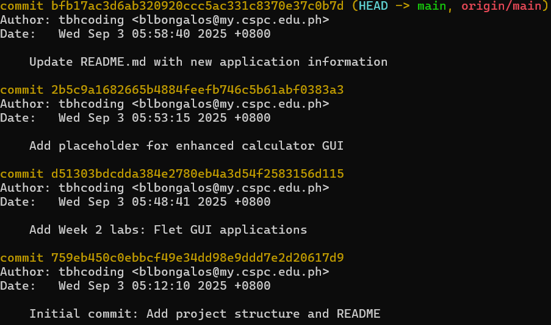
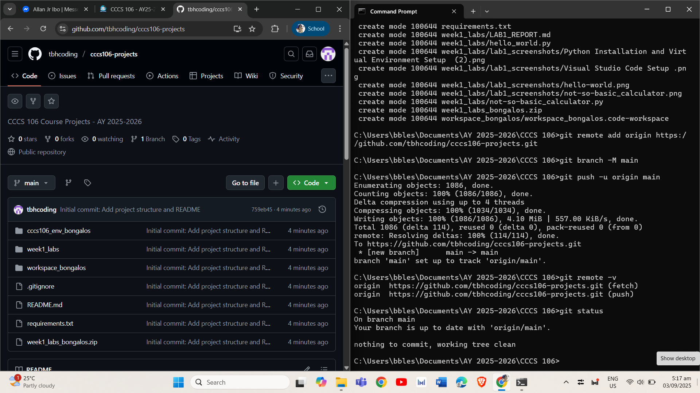
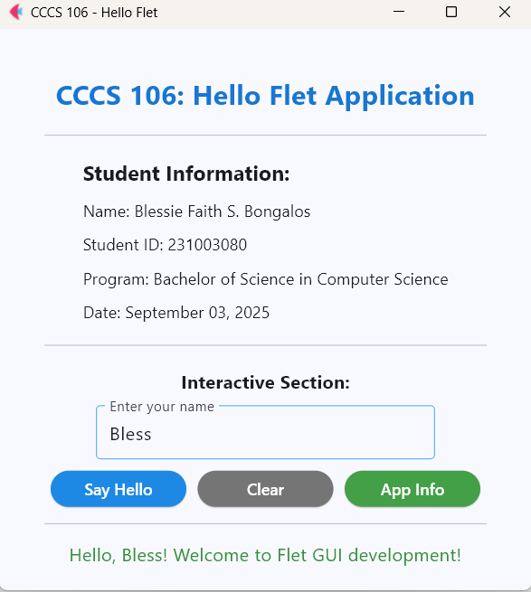
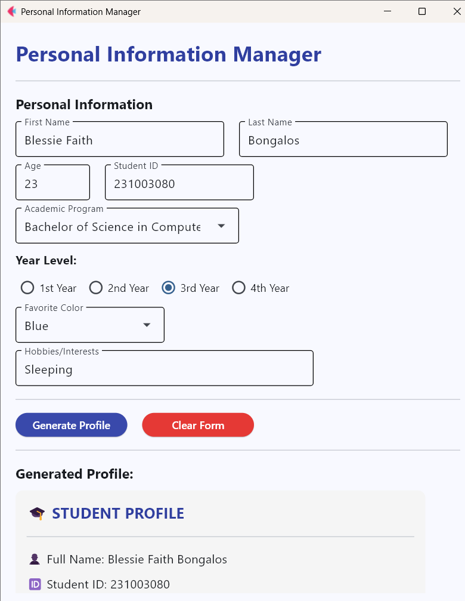

**Student Name:** Blessie Faith S. Bongalos
**Student ID:** 231003080
**Section:** BSCS 3-A
**Date:** 09/03/2025

## Git Configuration

### Repository Setup
- **GitHub Repository:** (https://github.com/tbhcoding/cccs106-projects)
- **Local Repository:** ✅ Initialized and connected
- **Commit History:** Here is the local commit history as of 6:30 AM Sept. 03, 2025 captured using `git log`:

### Git Skills Demonstrated
- ✅ Repository initialization and configuration
- ✅ Adding, committing, and pushing changes
- ✅ Branch creation and merging
- ✅ Remote repository management

## Flet GUI Applications

### 1. hello_flet.py
- **Status:** ✅ Completed
- **Features:** Interactive greeting, student info display, dialog boxes
- **UI Components:** Text, TextField, Buttons, Dialog, Containers
- **Notes:** Learned how to align elements using Row and Column upon studying the code

### 2. personal_info_gui.py
- **Status:** ✅ Completed
- **Features:** Form inputs, dropdowns, radio buttons, profile generation
- **UI Components:** TextField, Dropdown, RadioGroup, Containers, Scrolling
- **Error Handling:** Input validation and user feedback
- **Notes:** Encountered validation issues at first; solved by checking if not value: before generating profile.

## Technical Skills Developed

### Git Version Control
- Understanding of repository concepts
- Basic Git workflow (add, commit, push)
- Branch management and merging
- Remote repository collaboration

### Flet GUI Development
- Flet 0.28.3 syntax and components
- Page configuration and layout management
- Event handling and user interaction
- Modern UI design principles

## Challenges and Solutions

Problem: PowerShell execution policy blocked virtual environment activation.
Solution: Used Set-ExecutionPolicy -Scope Process -ExecutionPolicy Bypass to allow script execution.

## Learning Outcomes

- Gained practical experience with Git version control for collaborative programming.
- Learned to manage repositories and push updates to GitHub.
- Understood the workflow of GUI development in Python using Flet.
- Applied event-driven programming principles to create interactive applications.

## Screenshots

### Git Repository
-   

### GUI Applications
-   
-   

### Git Repository
- [ ] GitHub repository with commit history
- [ ] Local git log showing commits

### GUI Applications
- [ ] hello_flet.py running with all features
- [ ] personal_info_gui.py with filled form and generated profile

## Future Enhancements

= Add database connectivity (SQLite or Firebase) to save user profiles.
- Improve UI design with themes and icons.
- Create a multi-page application using Flet’s routing system.
= Explore deploying the GUI as a desktop app or web app.